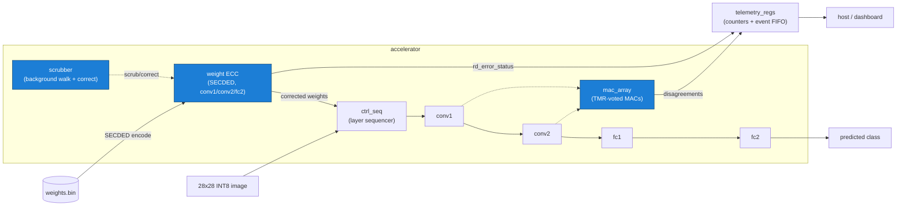

# Radical: our RAD-HARD-AI

**A radiation-hardened INT8 CNN inference accelerator in SystemVerilog.**

## The problem

Modern AI silicon is fast but fragile — a single cosmic-ray bit-flip in weight
memory silently corrupts an inference, with no error and no recovery. Space-grade
rad-hard processors (e.g. the RAD750 flying on Mars rovers) are robust but decades
behind commercial AI hardware in throughput. This project demonstrates modern ML
acceleration combined with hardware fault tolerance: an INT8 CNN accelerator whose
weight memory catches and corrects radiation-induced bit-flips at read time.

## Two reproducible RTL proofs

There are two independent, runnable proofs in this repo — both on the real
SystemVerilog, both honest about their scope:

1. **Standalone ECC demo** — proves the ECC *modules* (`weight_mem_ecc` +
   `ecc_secded` + `mac_array` + `telemetry_regs`) correct a single-bit upset and
   flag a double-bit one. `bash` one-liner below.
2. **Chip-level ECC integration** — proves ECC is wired into `chip.sv`'s **live
   weight datapath** for three of the four weight memories (conv1, conv2, fc2),
   with real telemetry counters moving from the integrated design. `bash scripts/demo.sh`.

## What's built (and honest verification status)

| Component | What it is | Status |
|---|---|---|
| `mac_array` | INT8 multiply-accumulate dot-product units | **Unit-tested, passing** (iverilog) |
| `telemetry_regs` | Counters + event FIFO (corrections, double-errors, etc.) | **Unit-tested, passing** (iverilog) |
| `tmr_voter` | Triple-modular-redundancy majority voter | **Unit-tested, passing** (iverilog) |
| `scrubber` | Background state machine that walks/corrects weight memory | **Unit-tested, passing** (iverilog) |
| `ecc_secded` | SECDED Hamming encoder/decoder | **Verified** in both demos + `weight_mem_ecc`/`scrubber` tests; standalone TB needs Verilator (uses constructs iverilog rejects) |
| `weight_mem_ecc` | ECC-protected weight SRAM | **ECC correct/detect path verified**; one *reset* check in its unit TB fails because the module intentionally models uninitialized SRAM (contents not cleared on reset) |
| `mac_tmr` | TMR-wrapped MAC | TMR voting verified via `tmr_voter`; `mac_tmr`'s own TB doesn't compile under iverilog (non-constant array index) |
| `fc1_stage` | FC1 dot product, pipelined into a multi-cycle FSM (`start`/`busy`/`done`) | **Unit-tested, passing**; restructure cut full-chip iverilog compile from 15+ min to ~2 s |
| `conv1`→`conv2`→`fc1`→`fc2`, `ctrl_seq` | 4-layer MNIST CNN pipeline | Unit testbenches pass; sequenced end-to-end inside `chip.sv` |
| `chip.sv` | Full top-level (AXI-lite + AXI-stream, sequences all 4 layers) | **ECC wired into the live weight path for conv1/conv2/fc2** with real telemetry; compiles + runs inference in ~2 s. fc1 weights not yet ECC-protected (see scope) |

## Standalone ECC demo (the modules)

```bash
iverilog -g2012 -o /tmp/ecc_demo.vvp tb/tb_ecc_demo.sv rtl/weight_mem_ecc.sv rtl/ecc_secded.sv rtl/mac_array.sv rtl/telemetry_regs.sv && vvp /tmp/ecc_demo.vvp
```

This instantiates the **real** `weight_mem_ecc`, `ecc_secded`, `mac_array`, and
`telemetry_regs` modules, loads 8 INT8 weights, and shows the same single-bit
fault three ways:

- **No fault:** MAC output = **259** (golden).
- **Fault, ECC off:** a bit-flip in a stored weight corrupts the output to **247**.
- **Fault, ECC on:** the Hamming decoder catches and corrects the flip, output is
  back to **259**, and the telemetry correction counter logs **1**.

Compiles and runs in ~1 second. (iverilog prints one harmless
`sorry: Case unique ... ignored` note; it does not affect the result.)

### Why this is legitimate

We adversarially audited the demo to rule out a script printing pre-decided
numbers. The output values `247`/`259` appear as literals **nowhere** in the
testbench (`grep` confirms) — they are computed by `mac_array`. Flipping a
*different* codeword bit produces a *different*, arithmetically-derivable wrong
value, yet ECC corrects every one back to 259:

| Injected codeword bit | ECC OFF (uncorrected) | ECC ON (corrected) | correction logged |
|---|---|---|---|
| bit 5 (data D3) | **247** | 259 | yes |
| bit 2 (data D1) | **262** | 259 | yes |

The math is consistent with real corruption: a D3 flip moves the weight 20→16
(−4 × activation 3 = −12 → 247); a D1 flip moves it 20→21 (+1 × 3 = +3 → 262). A
hardcoded script cannot produce a new, self-consistent wrong value for an
arbitrary flipped bit — this only happens because real Hamming logic is computing
on real corrupted memory state.

We also injected **two** bit-flips in one word: the decoder returns status
`2'b10` (uncorrectable), the data stays wrong (**17**, not 20), and the
double-error counter increments — genuine SECDED *single-correct / double-detect*
behavior, not a lookup.

**Scope note for this standalone demo only:** here the "ECC OFF" baseline and the
telemetry counter strobes are wired *in the testbench* (driven by the RTL's real
`rd_error_status`), because this demo exercises the bare modules, not `chip.sv`.
The correction decision itself is 100% real RTL. The chip-level test below uses
`chip.sv`'s own strobes, with nothing wired in the testbench.

## Chip-level ECC integration (the live datapath)

`chip.sv` now stores conv1/conv2/fc2 weights as **SECDED codewords** and decodes
+ corrects them on every read before they reach the compute stages, with the
decoder's `rd_error_status` driving the real `scrub_corrections` /
`ecc_double_errors` telemetry counters (previously tied to `0`).

Coverage: **1,544 of 26,632 weights** are ECC-protected —
conv1 `c1w` (72) + conv2 `c2w` (1152) + fc2 `f2w` (320). (fc1 not yet; see scope.)

Reproduce on the real RTL:

```bash
bash scripts/demo.sh
```

It compiles the full chip, runs a chip-level fault-injection simulation
(`tb/tb_chip_ecc_fault.sv`) that pokes single- and double-bit upsets into the
*stored codewords*, and prints the radiation story — every number parsed from the
live run, nothing hardcoded. Result table:

| array (layer) | clean | single-bit upset | double-bit upset |
|---|---|---|---|
| baseline | class **3**, scrub 0, ecc2 0 | — | — |
| conv1 (`c1w`) | — | class **3** held, **scrub +1** | **ecc2 +1**, class → 7 |
| conv2 (`c2w`) | — | class **3** held, **scrub +1** | **ecc2 +1**, class → 6 |
| fc2 (`f2w`) | — | class **3** held, **scrub +1** | **ecc2 +1**, class → 3 |

Single-bit upsets are **corrected** (output digit unchanged, corrections counter
increments); double-bit upsets are **detected** as uncorrectable (double-error
counter increments; the corrupted weight is *not* silently fixed, so the digit may
change — c1w→7, c2w→6, f2w stayed 3 because that weight didn't flip the argmax).
The counters move from `chip.sv`'s own datapath, not the testbench — distinguishing
a live wire from a dead one.

### Honest scope

- **fc1 (`f1w`, 25,088 weights) is NOT ECC-protected.** The per-weight parallel
  codec pattern that works for the smaller arrays would need 25,088 `ecc_secded`
  instances — measured to produce a **~407 MB** simulation binary (the whole chip
  is 11 MB) and evaluate 25,088 decoders every cycle. That's infeasible and absurd
  for area, because fc1 (now pipelined) reads only **32 weights per cycle**. The
  correct fix is a **sequential per-cycle decode** of those 32 weights *inside*
  `fc1_stage` (32 codecs, not 25,088) — a scoped extension that's been identified
  but deferred. We state this rather than imply full coverage.
- **`chip.sv` drops the conv biases**, so its predicted digit differs from the
  Python INT8 reference (the demo image: chip says **3**, the reference says 7).
  What the chip-level test proves is the **ECC invariant** — *a correctable fault
  leaves the output unchanged* — not absolute classification accuracy. The two are
  independent; the hardening claim does not depend on matching the reference.

## How the ECC works

SECDED Hamming: each 8-bit INT8 weight is stored as a **13-bit codeword** — 8 data
bits + 4 Hamming parity bits + 1 overall parity bit. On read, the decoder
recomputes parity to form a 4-bit **syndrome**: a non-zero syndrome with the
overall-parity bit set localizes a single-bit error to an exact position, which is
flipped back (corrected transparently). A non-zero syndrome with the overall
parity *clean* is the signature of a two-bit error — flagged as **uncorrectable**
rather than silently mis-corrected.

## Behavioral model results (Python, not RTL-measured)

These accuracy numbers come from `mock/behavioral_chip.py` — a Python behavioral
model of the accelerator — swept across fault-injection rates by `host/sweep.py`.
They show the *statistical* payoff of hardening over many runs, and are distinct
from (and not a substitute for) the single-fault RTL demos above.

| Injected BER | Unhardened accuracy | Hardened accuracy |
|---|---|---|
| 0.0   | 100%  | 100% |
| 0.003 | 96.7% | 100% |
| 0.03  | 96.7% | 100% |
| 0.1   | 96.7% | 100% |
| 0.2   | 76.7% | 100% |
| 0.4   | 70.0% | 100% |

(30 inferences per run; full data in `sweep_results.csv`, plot in
`sweep_accuracy.png`.) The unhardened baseline degrades as bit-flips accumulate in
weight memory; the hardened model holds because SECDED corrects the single-bit
errors that dominate. These are behavioral-model figures, **not** measurements
from the SystemVerilog RTL.

## Architecture



Hardening features (highlighted): **SECDED ECC** on weight memory (live in
`chip.sv` for conv1/conv2/fc2), a background **scrubber**, and **TMR**-voted MAC
units. ECC correction and double-error detection are proven by both demos above.

## Repository layout

```
rtl/        Synthesizable SystemVerilog (design + hardening modules; ECC wired in chip.sv)
tb/         Testbenches: tb_ecc_demo.sv (module demo), tb_chip_ecc_fault.sv (chip-level),
            tb_chip_infer.sv (inference check) + per-module unit TBs + sim bridges
scripts/    demo.sh — judge-facing chip-level radiation demo; verify_e2e.py — sim vs reference
model/      PyTorch training, INT8 quantization, weight export, golden references
host/       AXI driver, BER sweep, sim backends/bridge (backend-agnostic)
injector/   Random bit-flip fault injector at a target BER
mock/        fake_chip (stub) + behavioral_chip (INT8 inference under faults)
DEPS.yml    Per-bench RTL file lists for the sim flow
```
