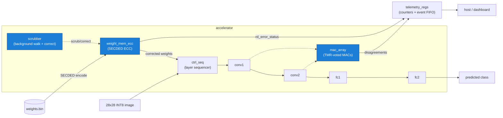

# RAD-HARD-AI

**A radiation-hardened INT8 CNN inference accelerator in SystemVerilog.**

## The problem

Modern AI silicon is fast but fragile — a single cosmic-ray bit-flip in weight
memory silently corrupts an inference, with no error and no recovery. Space-grade
rad-hard processors (e.g. the RAD750 flying on Mars rovers) are robust but decades
behind commercial AI hardware in throughput. This project demonstrates modern ML
acceleration combined with hardware fault tolerance: an INT8 CNN accelerator whose
weight memory catches and corrects radiation-induced bit-flips at read time.

## What's built (and honest verification status)

| Component | What it is | Status |
|---|---|---|
| `mac_array` | INT8 multiply-accumulate dot-product units | **Unit-tested, passing** (iverilog) |
| `telemetry_regs` | Counters + event FIFO (corrections, double-errors, etc.) | **Unit-tested, passing** (iverilog) |
| `tmr_voter` | Triple-modular-redundancy majority voter | **Unit-tested, passing** (iverilog) |
| `scrubber` | Background state machine that walks/corrects weight memory | **Unit-tested, passing** (iverilog) |
| `ecc_secded` | SECDED Hamming encoder/decoder | **Correction verified** in the demo + `weight_mem_ecc`/`scrubber` tests; standalone TB needs Verilator (uses constructs iverilog rejects) |
| `weight_mem_ecc` | ECC-protected weight SRAM | **ECC correct/detect path verified**; one *reset* check in its unit TB fails because the module intentionally models uninitialized SRAM (contents not cleared on reset) |
| `mac_tmr` | TMR-wrapped MAC | TMR voting verified via `tmr_voter`; `mac_tmr`'s own TB doesn't compile under iverilog (non-constant array index) |
| `conv1`→`conv2`→`fc1`→`fc2`, `ctrl_seq` | 4-layer MNIST CNN pipeline | Individual unit testbenches exist (`tb/tb_*.sv`); hand-verified during build |
| `chip.sv` | Full top-level (AXI-lite + AXI-stream, sequences all 4 layers) | **Compiles**, but full ECC-in-live-weight-path integration was **not completed** in the hackathon window — see caveats |

**Plainly:** the hardening primitives (ECC, scrubber, TMR voter) are built and
individually exercised, and the end-to-end ECC correction story runs as a
standalone demo. The full `chip.sv` pipeline compiles but does **not** yet route
weights through ECC in its live datapath, nor wire ECC status into telemetry. We
are **not** claiming the whole chip runs ECC-corrected inference end-to-end — it
does not yet. A behavioral model (`mock/behavioral_chip.py`) stands in for the
full-pipeline accuracy-under-faults story; the RTL proof below is the standalone
ECC demo.

## The demo (reproducible)

```bash
iverilog -g2012 -o /tmp/ecc_demo.vvp tb/tb_ecc_demo.sv rtl/weight_mem_ecc.sv rtl/ecc_secded.sv rtl/mac_array.sv rtl/telemetry_regs.sv && vvp /tmp/ecc_demo.vvp
```

This instantiates the **real** `weight_mem_ecc`, `ecc_secded`, `mac_array`, and
`telemetry_regs` modules, loads 8 INT8 weights, and shows the same single-bit
fault three ways:

- **No fault:** MAC output = **259** (golden).
- **Fault, ECC off:** a bit-flip in a stored weight corrupts the output to **247**.
- **Fault, ECC on:** the Hamming decoder catches and corrects the flip, output is
  back to **259**, and the telemetry correction counter logs **1**.

Clone the repo and run the command above — you get the same result. Compiles and
runs in ~1 second. (iverilog prints one harmless `sorry: Case unique ... ignored`
note; it does not affect the result.)

## Why this isn't faked

We adversarially audited the demo to rule out a script printing pre-decided
numbers. The output values `247`/`259` appear as literals **nowhere** in the
testbench (`grep` confirms) — they are computed by `mac_array`. Flipping a
*different* codeword bit produces a *different*, arithmetically-derivable wrong
value, yet ECC corrects every one back to 259:

| Injected codeword bit | ECC OFF (uncorrected) | ECC ON (corrected) | correction logged |
|---|---|---|---|
| bit 5 (data D3) | **247** | 259 | yes |
| bit 2 (data D1) | **262** | 259 | yes |

The math is consistent with real corruption: a D3 flip moves the weight 20→16
(−4 × activation 3 = −12 → 247); a D1 flip moves it 20→21 (+1 × 3 = +3 → 262). A
hardcoded script cannot produce a new, self-consistent wrong value for an
arbitrary flipped bit — this only happens because real Hamming logic is computing
on real corrupted memory state.

We also injected **two** bit-flips in one word: the decoder returns status
`2'b10` (uncorrectable), the data stays wrong (**17**, not 20), and the
double-error counter increments — genuine SECDED *single-correct / double-detect*
behavior, not a lookup.

### Honest caveats

1. The "ECC OFF" baseline is **reconstructed in the testbench** (the correct
   *uncorrected* value), not read from a separate unhardened memory datapath.
2. The telemetry counter strobes are **wired in the testbench**, driven by the
   RTL's real `rd_error_status` output — because `chip.sv` does not yet route ECC
   status into `telemetry_regs` (the unbuilt integration step).

In both cases the **correction decision itself is 100% real RTL** (`ecc_secded`
syndrome decoding on actual flipped memory). Only the baseline reconstruction and
the status→counter wiring live in the testbench. Neither fabricates the correction
result.

## How the ECC works

SECDED Hamming: each 8-bit INT8 weight is stored as a **13-bit codeword** — 8 data
bits + 4 Hamming parity bits + 1 overall parity bit. On read, the decoder
recomputes parity to form a 4-bit **syndrome**: a non-zero syndrome with the
overall-parity bit set localizes a single-bit error to an exact position, which is
flipped back (corrected transparently). A non-zero syndrome with the overall
parity *clean* is the signature of a two-bit error — flagged as **uncorrectable**
rather than silently mis-corrected.

## Architecture



Hardening features (highlighted): **SECDED ECC** on weight memory, a background
**scrubber**, and **TMR**-voted MAC units. ECC correction and double-error
detection are the parts proven by the runnable demo above.

## Repository layout

```
rtl/        Synthesizable SystemVerilog (design + hardening modules)
tb/         Testbenches incl. tb_ecc_demo.sv (the demo above) + sim bridges
model/      PyTorch training, INT8 quantization, weight export, golden references
host/       AXI driver, BER sweep, sim backends/bridge (backend-agnostic)
injector/   Random bit-flip fault injector at a target BER
mock/        fake_chip (stub) + behavioral_chip (INT8 inference under faults)
scripts/    verify_e2e.py — RTL/behavioral sim vs Python reference
DEPS.yml    Per-bench RTL file lists for the sim flow
```
